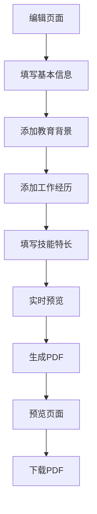

## 1. 产品概述

简历编辑器是一款基于Web的在线简历制作工具，旨在帮助用户快速创建专业的中文简历。用户通过简单的表单填写，即可实时预览简历效果，并一键生成格式完美的PDF文件。

产品解决的核心问题：传统简历制作需要复杂的排版和格式调整，本工具通过智能布局算法自动处理字体缩放、间距调整和分页，让用户专注于内容本身。

## 2. 核心功能

### 2.1 用户角色
| 角色 | 注册方式 | 核心权限 |
|------|----------|----------|
| 普通用户 | 无需注册，直接使用 | 填写简历信息、预览、下载PDF |

### 2.2 功能模块

简历编辑器包含以下核心页面：

1. **编辑页面**：表单输入、实时预览、PDF下载
2. **预览页面**：全屏预览、打印优化、下载按钮

### 2.3 页面详情

| 页面名称 | 模块名称 | 功能描述 |
|----------|----------|----------|
| 编辑页面 | 基本信息表单 | 填写姓名、联系方式、求职意向等个人信息 |
| 编辑页面 | 教育背景表单 | 添加/删除教育经历，包含时间、学校、专业、学历 |
| 编辑页面 | 工作经历表单 | 添加/删除工作经历，包含公司、职位、时间、描述 |
| 编辑页面 | 技能特长表单 | 填写技能分类和具体技能项 |
| 编辑页面 | 实时预览区域 | 右侧显示简历实时预览效果 |
| 编辑页面 | PDF生成按钮 | 一键生成并下载PDF文件 |
| 预览页面 | 全屏预览 | 展示完整简历效果 |
| 预览页面 | 打印优化 | 适配A4纸张打印格式 |
| 预览页面 | 下载功能 | 提供PDF文件下载 |

## 3. 核心流程

用户操作流程：
1. 用户进入编辑页面
2. 填写基本信息表单
3. 添加教育背景信息
4. 添加工作经历信息
5. 填写技能特长
6. 实时查看右侧预览效果
7. 点击生成PDF按钮
8. 在新页面预览完整简历
9. 下载PDF文件

## 4. 用户界面设计

### 4.1 设计风格
- **主色调**：深蓝色 (#1e40af) 和白色 (#ffffff)
- **按钮样式**：圆角矩形，悬停效果
- **字体**：中文使用思源黑体，英文使用Arial
- **布局风格**：左右分栏，左侧表单，右侧预览
- **图标风格**：使用简洁的线性图标

### 4.2 页面设计概述

| 页面名称 | 模块名称 | UI元素 |
|----------|----------|--------|
| 编辑页面 | 表单区域 | 左侧占60%宽度，白色背景，卡片式分组，输入框带边框和圆角 |
| 编辑页面 | 预览区域 | 右侧占40%宽度，浅灰色背景，A4纸张比例预览，真实字体显示 |
| 编辑页面 | 操作按钮 | 底部固定工具栏，包含"预览完整简历"和"生成PDF"按钮 |
| 预览页面 | 简历展示 | 居中显示，A4纸张尺寸，标准中文简历格式 |
| 预览页面 | 操作栏 | 顶部浮动工具栏，包含"返回编辑"和"下载PDF"按钮 |

### 4.3 响应式设计
- **桌面优先**：主要适配1920x1080分辨率
- **平板适配**：768px以上宽度保持左右布局
- **手机适配**：低于768px切换为上下布局，预览区域在表单下方
- **触摸优化**：按钮和输入区域增大点击范围