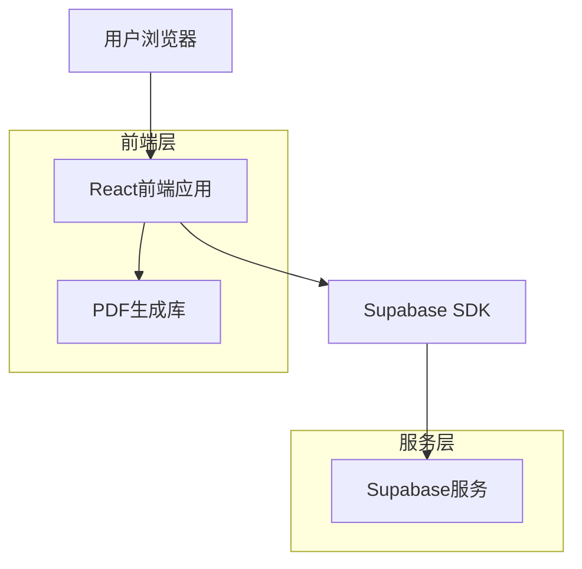
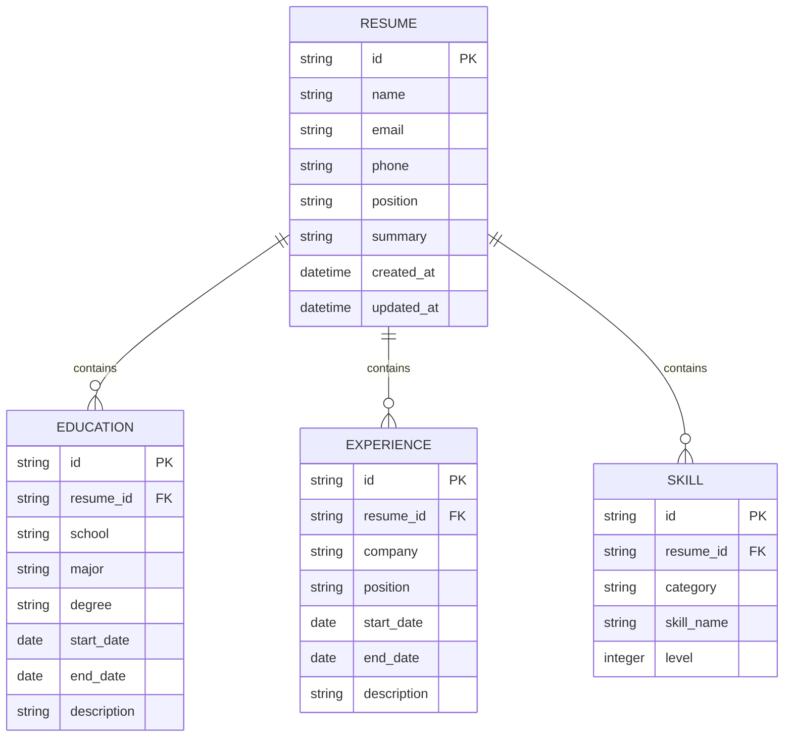

## 1. 架构设计



## 2. 技术描述

- **前端**：React@18 + TypeScript + Tailwind CSS + Vite
- **后端**：无独立后端，使用Supabase作为BaaS
- **数据库**：Supabase (PostgreSQL)
- **PDF生成**：html2canvas + jspdf
- **状态管理**：React Context + useReducer
- **表单处理**：React Hook Form
- **UI组件**：Headless UI + 自定义组件

## 3. 路由定义

| 路由 | 用途 |
|------|------|
| / | 编辑页面，主要简历编辑界面 |
| /preview | 预览页面，全屏简历预览 |
| /template | 模板选择页面（可选） |

## 4. 数据模型

### 4.1 数据模型定义



### 4.2 数据定义语言

简历主表 (resumes)
```sql
-- 创建简历表
CREATE TABLE resumes (
    id UUID PRIMARY KEY DEFAULT gen_random_uuid(),
    name VARCHAR(100) NOT NULL,
    email VARCHAR(255) NOT NULL,
    phone VARCHAR(20) NOT NULL,
    position VARCHAR(100) NOT NULL,
    summary TEXT,
    created_at TIMESTAMP WITH TIME ZONE DEFAULT NOW(),
    updated_at TIMESTAMP WITH TIME ZONE DEFAULT NOW()
);

-- 创建索引
CREATE INDEX idx_resumes_created_at ON resumes(created_at DESC);
```

教育背景表 (educations)
```sql
-- 创建教育背景表
CREATE TABLE educations (
    id UUID PRIMARY KEY DEFAULT gen_random_uuid(),
    resume_id UUID REFERENCES resumes(id) ON DELETE CASCADE,
    school VARCHAR(200) NOT NULL,
    major VARCHAR(200) NOT NULL,
    degree VARCHAR(100) NOT NULL,
    start_date DATE NOT NULL,
    end_date DATE,
    description TEXT,
    created_at TIMESTAMP WITH TIME ZONE DEFAULT NOW()
);

-- 创建索引
CREATE INDEX idx_educations_resume_id ON educations(resume_id);
```

工作经历表 (experiences)
```sql
-- 创建工作经历表
CREATE TABLE experiences (
    id UUID PRIMARY KEY DEFAULT gen_random_uuid(),
    resume_id UUID REFERENCES resumes(id) ON DELETE CASCADE,
    company VARCHAR(200) NOT NULL,
    position VARCHAR(200) NOT NULL,
    start_date DATE NOT NULL,
    end_date DATE,
    description TEXT,
    created_at TIMESTAMP WITH TIME ZONE DEFAULT NOW()
);

-- 创建索引
CREATE INDEX idx_experiences_resume_id ON experiences(resume_id);
```

技能表 (skills)
```sql
-- 创建技能表
CREATE TABLE skills (
    id UUID PRIMARY KEY DEFAULT gen_random_uuid(),
    resume_id UUID REFERENCES resumes(id) ON DELETE CASCADE,
    category VARCHAR(100) NOT NULL,
    skill_name VARCHAR(200) NOT NULL,
    level INTEGER CHECK (level >= 1 AND level <= 5),
    created_at TIMESTAMP WITH TIME ZONE DEFAULT NOW()
);

-- 创建索引
CREATE INDEX idx_skills_resume_id ON skills(resume_id);
```

### 4.3 权限设置

```sql
-- 匿名用户权限
GRANT SELECT ON resumes TO anon;
GRANT SELECT ON educations TO anon;
GRANT SELECT ON experiences TO anon;
GRANT SELECT ON skills TO anon;

-- 认证用户权限
GRANT ALL PRIVILEGES ON resumes TO authenticated;
GRANT ALL PRIVILEGES ON educations TO authenticated;
GRANT ALL PRIVILEGES ON experiences TO authenticated;
GRANT ALL PRIVILEGES ON skills TO authenticated;
```

## 5. PDF生成技术要求

### 5.1 字体处理
- 支持中文字体嵌入（思源黑体）
- 自动字体缩放算法：根据内容长度调整字体大小
- 最小字体限制：正文字号不小于10px，标题不小于14px

### 5.2 布局算法
- 智能分页：避免段落被分割到两页
- 自动间距调整：根据内容密度调整行间距和段间距
- 边距控制：A4纸张标准边距（上下2.5cm，左右2cm）

### 5.3 性能要求
- PDF生成时间：<3秒
- 预览渲染时间：<1秒
- 支持分页预览

## 6. 性能优化

### 6.1 前端优化
- 组件懒加载
- 图片压缩和CDN加速
- 表单输入防抖
- 虚拟滚动（长列表情况）

### 6.2 渲染优化
- 使用React.memo防止不必要的重渲染
- CSS-in-JS优化
- 预览区域增量更新

## 7. 浏览器兼容性

### 7.1 支持浏览器
- Chrome 90+
- Firefox 88+
- Safari 14+
- Edge 90+

### 7.2 移动端支持
- iOS Safari 14+
- Android Chrome 90+
- 微信内置浏览器

## 8. 部署配置

### 8.1 环境变量
```bash
VITE_SUPABASE_URL=
VITE_SUPABASE_ANON_KEY=
VITE_PDF_GENERATION_TIMEOUT=3000
VITE_MAX_FILE_SIZE=10485760
```

### 8.2 构建配置
- 使用Vite进行构建优化
- 启用Gzip压缩
- 设置合理的缓存策略
- CDN配置（可选）